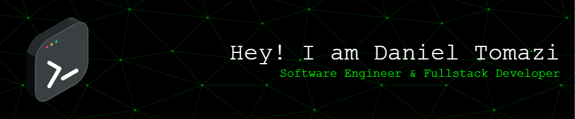

  

#

Bacharelado em Ciência da Computação e futuro Mestrando na área de tecnologia residente de São Paulo. Atualmente trabalho como Engenheiro de Software no banco EstBank.
Estou constantemente atualizando meus conhecimentos e buscando novos desafios na área de tecnologia. Tenho paixão por aprender e aplicar esses conhecimentos para criar soluções inovadoras.

#

<h3 align="left">Connect with me!</h3>

<h3 align="left">My Stack</h3>

  
  
  
  
  
  
  
  
  
  
  
  
  
  
  
  
  
  
  

#

  
  <h3>* GitHub Stats *</h3>
   

    
  </a>

#

<picture align="center">
  <source media="(prefers-color-scheme: dark)" srcset="https://raw.githubusercontent.com/DanielTomazi/DanielTomazi/output/github-contribution-grid-snake-dark.svg">
  <source media="(prefers-color-scheme: light)" srcset="https://raw.githubusercontent.com/DanielTomazi/DanielTomazi/output/github-contribution-grid-snake-dark.svg">
  
</picture>
